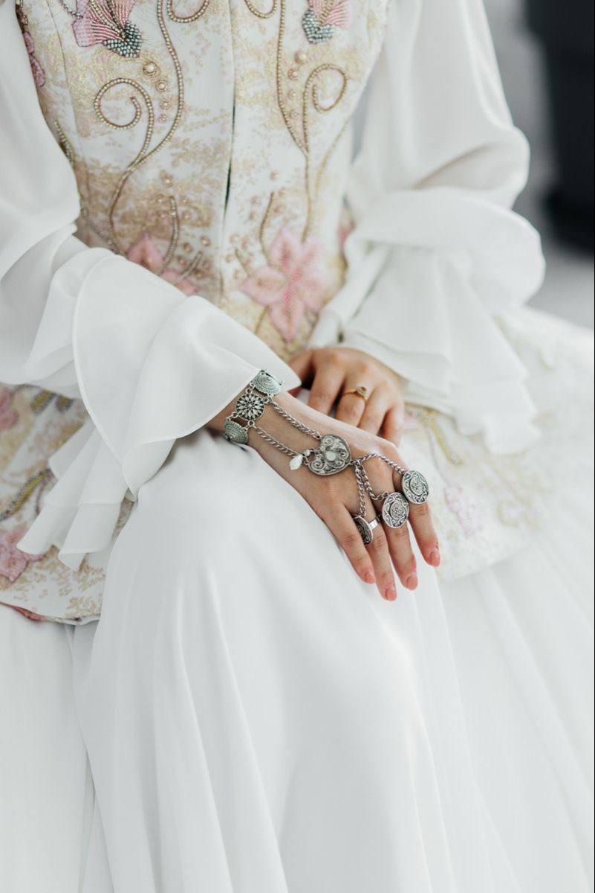
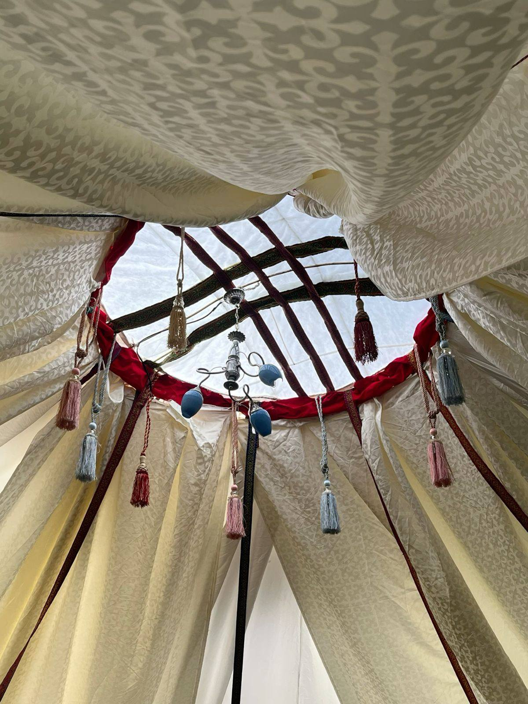

# Сырға салу той — сайт-приглашение (посадочная страница)

Полный план лендинга с RSVP-формой, которая отправляет ответы гостей в Google-таблицу.
Стиль: **кремово-золотой, нежный**. Готовый одностраничный HTML-код + код Google Apps Script + пошаговая настройка.

---

## 1. Данные события (контент)

| Поле | Значение |
|---|---|
| Название | **Гүлжайна сырға салу** |
| Дата | 22 тамыз 2026 ж. |
| Уақыты | Сағат 12:00 |
| Орны | «Rahhat» мейрамханасы, Кіші зал |
| Мекенжайы | «Көк-Өзек» ӨК аумағы, Алматы қаласы, Алатау ауданы, Мәдениет ш/а, 1163 |
| Той иелері | Қазбек–Мадина, Жеңісбек–Марал |

**Приглашение (главный текст):**

> Біздің өміріміздегі ең маңызды және ерекше күндердің бірі жақындап келеді. Осы қуанышымызды сізбен бөліскіміз келеді! Сіздерді **сырға салу рәсіміне** шақырамыз.

---

## 2. Дизайн-концепция «Кремово-золотой, нежный»

Идея — перенести атмосферу двух фото (кружевное платье невесты с серебряным украшением + шаңырақ с кистями) в лёгкую, воздушную веб-обёртку.

**Палитра (CSS-переменные):**

```css
:root{
  --cream:      #F7F1E7;  /* фон */
  --cream-deep: #EFE5D3;  /* секции-подложки */
  --gold:       #C6A15B;  /* акцент, линии, кнопки */
  --gold-soft:  #E4D3A8;  /* тонкие рамки */
  --rose:       #E7C9C6;  /* нежно-розовый акцент */
  --ink:        #4A4038;  /* основной текст (тёплый графит) */
  --ink-soft:   #8A7C6C;  /* второстепенный текст */
  --white:      #FFFFFF;
}
```

**Шрифты (Google Fonts):**

- Заголовки — `Playfair Display` (элегантная антиква с засечками) или `Cormorant Garamond`.
- Основной текст — `Manrope` или `Jost` (чистый гротеск, хорошо читает кириллицу и казахские буквы ә, ғ, қ, ң, ө, ұ, ү, һ, і).

**Декор:**

- Тонкие золотые разделители-«орнаменты» (◈ ─────── ◈).
- Полупрозрачный казахский орнамент/шаңырақ фоном в hero (можно SVG или фото с наложением кремовой вуали `rgba(247,241,231,.55)`).
- Мягкие тени, скругления `border-radius: 18px`, много «воздуха».
- Плавные fade-in анимации при прокрутке.

---

## 3. Фотографии

В коде используются два загруженных фото. Положите их рядом с `index.html` в папку `images/`:

- `images/nevesta.jpg` — руки невесты с серебряным украшением (для hero-блока).
- `images/shanyrak.jpg` — шаңырақ с кистями (для блока-разделителя / фон деталей).

> Если хостинг не позволяет папки — можно вставить фото как base64 прямо в `src`, но проще залить файлы рядом.

---

## 4. Структура страницы (секции)

1. **Hero** — фото рук невесты, имя «Гүлжайна», подзаголовок «Сырға салу», дата.
2. **Приглашение** — главный текст-обращение.
3. **Детали** — дата, время, адрес + кнопка «Открыть в 2ГИС/картах».
4. **Той иелері** — имена принимающих семей.
5. **Разделитель** — фото шаңырақа с цитатой.
6. **RSVP-форма** — Имя и фамилия · Придёте? · Приду с +1?
7. **Футер** — тёплое «Сіздерді күтеміз!».

---

## 5. Готовый код `index.html`

Скопируйте в файл `index.html`. Одна строка требует правки — вставить ссылку из Google Apps Script (шаг в разделе 6): переменная `SCRIPT_URL`.

```html
<!DOCTYPE html>
<html lang="kk">
<head>
<meta charset="UTF-8">
<meta name="viewport" content="width=device-width, initial-scale=1.0">
<title>Гүлжайна · Сырға салу</title>
<link rel="preconnect" href="https://fonts.googleapis.com">
<link href="https://fonts.googleapis.com/css2?family=Playfair+Display:ital,wght@0,500;0,600;1,500&family=Jost:wght@300;400;500&display=swap" rel="stylesheet">
<style>
:root{
  --cream:#F7F1E7; --cream-deep:#EFE5D3; --gold:#C6A15B; --gold-soft:#E4D3A8;
  --rose:#E7C9C6; --ink:#4A4038; --ink-soft:#8A7C6C; --white:#fff;
}
*{margin:0;padding:0;box-sizing:border-box}
html{scroll-behavior:smooth}
body{
  font-family:'Jost',sans-serif;color:var(--ink);background:var(--cream);
  line-height:1.7;font-weight:300;letter-spacing:.2px;
}
h1,h2,h3{font-family:'Playfair Display',serif;font-weight:500;letter-spacing:.5px}
.wrap{max-width:640px;margin:0 auto;padding:0 24px}
.divider{display:flex;align-items:center;justify-content:center;gap:14px;color:var(--gold);margin:38px 0;font-size:14px}
.divider::before,.divider::after{content:"";height:1px;width:70px;background:linear-gradient(90deg,transparent,var(--gold-soft),transparent)}

/* HERO */
.hero{position:relative;min-height:100vh;display:flex;align-items:center;justify-content:center;text-align:center;overflow:hidden}
.hero img.bg{position:absolute;inset:0;width:100%;height:100%;object-fit:cover;object-position:center}
.hero::after{content:"";position:absolute;inset:0;background:linear-gradient(180deg,rgba(247,241,231,.35) 0%,rgba(247,241,231,.55) 55%,rgba(247,241,231,.92) 100%)}
.hero-inner{position:relative;z-index:2;padding:40px 24px}
.hero .eyebrow{letter-spacing:6px;text-transform:uppercase;font-size:12px;color:var(--gold);margin-bottom:18px}
.hero h1{font-size:clamp(42px,12vw,78px);line-height:1;color:var(--ink)}
.hero .sub{font-size:clamp(18px,5vw,24px);color:var(--ink-soft);font-style:italic;font-family:'Playfair Display',serif;margin-top:12px}
.hero .date{margin-top:26px;font-size:15px;letter-spacing:3px;color:var(--ink)}
.hero .scroll{position:absolute;bottom:26px;left:50%;transform:translateX(-50%);z-index:2;color:var(--gold);font-size:22px;animation:bounce 2s infinite}
@keyframes bounce{0%,100%{transform:translate(-50%,0)}50%{transform:translate(-50%,8px)}}

/* SECTIONS */
section.block{padding:70px 0}
.reveal{opacity:0;transform:translateY(24px);transition:.9s ease}
.reveal.on{opacity:1;transform:none}
.invite-text{text-align:center;font-size:19px;color:var(--ink);font-family:'Playfair Display',serif;line-height:1.9}
.invite-text b{color:var(--gold)}

/* DETAILS card */
.card{background:var(--white);border:1px solid var(--gold-soft);border-radius:18px;padding:34px 28px;text-align:center;box-shadow:0 18px 50px rgba(198,161,91,.10)}
.card h3{font-size:22px;margin-bottom:6px}
.detail-row{display:flex;flex-direction:column;gap:4px;margin:22px 0}
.detail-row .label{font-size:11px;letter-spacing:3px;text-transform:uppercase;color:var(--gold)}
.detail-row .value{font-size:18px;color:var(--ink)}
.btn{display:inline-block;margin-top:10px;padding:13px 30px;border-radius:40px;background:var(--gold);color:#fff;text-decoration:none;font-size:14px;letter-spacing:1px;border:none;cursor:pointer;transition:.25s}
.btn:hover{background:#b28e48;transform:translateY(-2px)}

/* HOSTS */
.hosts{text-align:center}
.hosts .pair{font-family:'Playfair Display',serif;font-size:24px;color:var(--ink);margin:6px 0}

/* PHOTO DIVIDER */
.photo-divider{position:relative;height:60vh;min-height:340px;display:flex;align-items:center;justify-content:center;text-align:center;overflow:hidden}
.photo-divider img{position:absolute;inset:0;width:100%;height:100%;object-fit:cover}
.photo-divider::after{content:"";position:absolute;inset:0;background:rgba(74,64,56,.30)}
.photo-divider .quote{position:relative;z-index:2;color:#fff;font-family:'Playfair Display',serif;font-style:italic;font-size:clamp(20px,5vw,28px);padding:0 30px;text-shadow:0 2px 20px rgba(0,0,0,.4)}

/* FORM */
.form-wrap{background:var(--cream-deep);border-radius:22px;padding:40px 28px}
.form-wrap h2{text-align:center;font-size:28px;margin-bottom:6px}
.form-wrap .lead{text-align:center;color:var(--ink-soft);margin-bottom:28px;font-size:15px}
.field{margin-bottom:22px}
.field label{display:block;font-size:13px;letter-spacing:1px;color:var(--ink);margin-bottom:8px}
.field input[type=text]{width:100%;padding:14px 16px;border:1px solid var(--gold-soft);border-radius:12px;background:#fff;font-family:inherit;font-size:16px;color:var(--ink);outline:none;transition:.2s}
.field input[type=text]:focus{border-color:var(--gold);box-shadow:0 0 0 3px rgba(198,161,91,.15)}
.options{display:flex;gap:12px;flex-wrap:wrap}
.opt{flex:1;min-width:130px}
.opt input{position:absolute;opacity:0}
.opt label{display:block;text-align:center;padding:14px;border:1px solid var(--gold-soft);border-radius:12px;background:#fff;cursor:pointer;transition:.2s;margin:0;font-size:15px}
.opt input:checked + label{background:var(--gold);color:#fff;border-color:var(--gold)}
.submit{width:100%;margin-top:8px;font-size:16px;padding:16px}
.msg{text-align:center;margin-top:18px;font-size:15px;min-height:22px}
.msg.ok{color:#5a7d4f}
.msg.err{color:#b45a4f}

footer{text-align:center;padding:60px 24px 70px}
footer .heart{color:var(--gold);font-size:22px}
footer p{color:var(--ink-soft);margin-top:10px;font-size:15px}
</style>
</head>
<body>

<!-- HERO -->
<header class="hero">
  
  <div class="hero-inner">
    <div class="eyebrow">Сырға салу рәсімі</div>
    <h1>Гүлжайна</h1>
    <div class="sub">сырға салу тойына шақырамыз</div>
    <div class="date">22 · 08 · 2026 &nbsp;•&nbsp; 12:00</div>
  </div>
  <div class="scroll">⌄</div>
</header>

<!-- INVITATION -->
<section class="block">
  <div class="wrap reveal">
    <div class="divider">◈</div>
    <p class="invite-text">
      Біздің өміріміздегі ең маңызды және ерекше күндердің бірі жақындап келеді.
      Осы қуанышымызды сізбен бөліскіміз келеді!<br><br>
      Сіздерді <b>сырға салу рәсіміне</b> шақырамыз.
    </p>
    <div class="divider">◈</div>
  </div>
</section>

<!-- DETAILS -->
<section class="block">
  <div class="wrap reveal">
    <div class="card">
      <h3>Той қашан және қайда</h3>
      <div class="detail-row">
        <span class="label">Күні</span>
        <span class="value">22 тамыз 2026 ж., сағат 12:00</span>
      </div>
      <div class="detail-row">
        <span class="label">Орны</span>
        <span class="value">«Rahhat» мейрамханасы · Кіші зал</span>
      </div>
      <div class="detail-row">
        <span class="label">Мекенжайы</span>
        <span class="value">«Көк-Өзек» ӨК аумағы, Алматы қ., Алатау ауданы,<br>Мәдениет ш/а, 1163</span>
      </div>
      <!-- Замените ссылку на реальную точку в 2ГИС/Google Maps -->
      <a class="btn" href="https://2gis.kz/almaty" target="_blank" rel="noopener">Картадан қарау</a>
    </div>
  </div>
</section>

<!-- HOSTS -->
<section class="block">
  <div class="wrap reveal hosts">
    <div class="divider">Той иелері</div>
    <div class="pair">Қазбек — Мадина</div>
    <div class="pair">Жеңісбек — Марал</div>
  </div>
</section>

<!-- PHOTO DIVIDER -->
<div class="photo-divider">
  
  <div class="quote">«Отбасының шаңырағы биік, ырысы мол болсын»</div>
</div>

<!-- RSVP FORM -->
<section class="block">
  <div class="wrap reveal">
    <div class="form-wrap">
      <h2>Келуіңізді растаңыз</h2>
      <p class="lead">Өтінеміз, 15 тамызға дейін жауап беріңіз</p>

      <form id="rsvp">
        <!-- Имя и фамилия -->
        <div class="field">
          <label for="name">Аты-жөніңіз</label>
          <input type="text" id="name" name="name" placeholder="Мысалы: Айгүл Серікова" required>
        </div>

        <!-- Придёт / не придёт -->
        <div class="field">
          <label>Тойға келесіз бе?</label>
          <div class="options">
            <div class="opt">
              <input type="radio" id="yes" name="attending" value="Келемін" required>
              <label for="yes">Иә, келемін</label>
            </div>
            <div class="opt">
              <input type="radio" id="no" name="attending" value="Келе алмаймын">
              <label for="no">Өкінішке орай, жоқ</label>
            </div>
          </div>
        </div>

        <!-- +1 -->
        <div class="field">
          <label>Серіктеспен келесіз бе? (+1)</label>
          <div class="options">
            <div class="opt">
              <input type="radio" id="plus-solo" name="plusone" value="Жалғыз" required>
              <label for="plus-solo">Жалғыз</label>
            </div>
            <div class="opt">
              <input type="radio" id="plus-one" name="plusone" value="Серіктеспен (+1)">
              <label for="plus-one">Серіктеспен (+1)</label>
            </div>
          </div>
        </div>

        <button type="submit" class="btn submit">Жіберу</button>
        <div class="msg" id="msg"></div>
      </form>
    </div>
  </div>
</section>

<footer>
  <div class="heart">◈</div>
  <p>Сіздерді қуанышпен күтеміз!</p>
</footer>

<script>
// === ВСТАВЬТЕ СЮДА ССЫЛКУ ИЗ GOOGLE APPS SCRIPT (раздел 6) ===
const SCRIPT_URL = "PASTE_YOUR_WEB_APP_URL_HERE";

// Плавное появление секций
const io = new IntersectionObserver((entries)=>{
  entries.forEach(e=>{ if(e.isIntersecting) e.target.classList.add('on'); });
},{threshold:.15});
document.querySelectorAll('.reveal').forEach(el=>io.observe(el));

// Отправка формы
const form = document.getElementById('rsvp');
const msg  = document.getElementById('msg');
form.addEventListener('submit', async (e)=>{
  e.preventDefault();
  const btn = form.querySelector('.submit');
  btn.disabled = true; btn.textContent = 'Жіберілуде...';
  msg.className = 'msg'; msg.textContent = '';

  const data = new FormData(form);
  try{
    await fetch(SCRIPT_URL, { method:'POST', body:data });
    form.reset();
    msg.className = 'msg ok';
    msg.textContent = 'Рахмет! Жауабыңыз қабылданды 🤍';
    btn.textContent = 'Жіберілді ✓';
  }catch(err){
    msg.className = 'msg err';
    msg.textContent = 'Қате шықты. Қайта көріңіз.';
    btn.disabled = false; btn.textContent = 'Жіберу';
  }
});
</script>
</body>
</html>
```

---

## 6. Подключение Google-таблицы (RSVP → Google Sheets)

Форма отправляет ответы через бесплатный **Google Apps Script** — сервер не нужен, всё держится на вашем Google-аккаунте.

### Шаг 1. Создать таблицу
1. Откройте [sheets.google.com](https://sheets.google.com) → создайте таблицу, назовите её напр. `Сырға салу — RSVP`.
2. В первой строке впишите заголовки столбцов (ровно в таком порядке):

   | A | B | C | D |
   |---|---|---|---|
   | Уақыты | Аты-жөні | Келу | Серіктес |

### Шаг 2. Открыть редактор скриптов
В таблице: **Расширения → Apps Script** (Extensions → Apps Script). Удалите весь код и вставьте:

```javascript
function doPost(e) {
  var lock = LockService.getScriptLock();
  lock.waitLock(20000);
  try {
    var sheet = SpreadsheetApp.getActiveSpreadsheet().getSheets()[0];
    sheet.appendRow([
      new Date(),
      e.parameter.name || '',
      e.parameter.attending || '',
      e.parameter.plusone || ''
    ]);
    return ContentService
      .createTextOutput(JSON.stringify({ result: 'success' }))
      .setMimeType(ContentService.MimeType.JSON);
  } catch (err) {
    return ContentService
      .createTextOutput(JSON.stringify({ result: 'error', message: err.message }))
      .setMimeType(ContentService.MimeType.JSON);
  } finally {
    lock.releaseLock();
  }
}
```

> Имена полей `name`, `attending`, `plusone` совпадают с атрибутами `name="..."` в форме — не меняйте их.

### Шаг 3. Опубликовать как веб-приложение
1. Справа вверху **Deploy → New deployment**.
2. Шестерёнка → тип **Web app**.
3. Настройки:
   - **Execute as**: *Me (ваш email)*
   - **Who has access**: *Anyone* (обязательно, иначе гости не смогут отправить).
4. **Deploy** → подтвердите доступ (Authorize access → выберите аккаунт → Advanced → Go to project → Allow).
5. Скопируйте **Web app URL** (вида `https://script.google.com/macros/s/XXXX/exec`).

### Шаг 4. Вставить ссылку в сайт
В `index.html` найдите строку и вставьте URL:

```javascript
const SCRIPT_URL = "https://script.google.com/macros/s/XXXX/exec";
```

Готово. Каждый ответ гостя автоматически появится новой строкой в таблице с датой и временем.

> ⚠️ Если позже правите скрипт — делайте **Deploy → Manage deployments → Edit → Version: New version**, иначе изменения не применятся.

---

## 7. Где разместить сайт (хостинг, бесплатно)

Любой из вариантов — файл `index.html` + папка `images/`:

- **Netlify Drop** — [app.netlify.com/drop](https://app.netlify.com/drop): перетащили папку → готовая ссылка за 10 секунд.
- **GitHub Pages** — залить репозиторий, включить Pages.
- **Vercel** — импорт папки, деплой в один клик.

Затем короткую ссылку можно раздать гостям в WhatsApp/Instagram.

---

## 8. Чек-лист перед запуском

- [ ] Фото лежат в `images/nevesta.jpg` и `images/shanyrak.jpg`.
- [ ] `SCRIPT_URL` заменён на реальную ссылку из Apps Script.
- [ ] Кнопка «Картадан қарау» ведёт на точную точку в 2ГИС/Google Maps.
- [ ] Тестовая отправка формы → строка появилась в таблице.
- [ ] Deploy доступ = **Anyone**.
- [ ] Дедлайн ответа (15 тамыз) актуален.
- [ ] Проверено на телефоне (большинство гостей откроют с мобильного).

---

*Стиль: кремово-золотой, нежный. Все тексты — на казахском, под тон приглашения. Форма собирает: имя и фамилию, придёт/не придёт, +1.*
